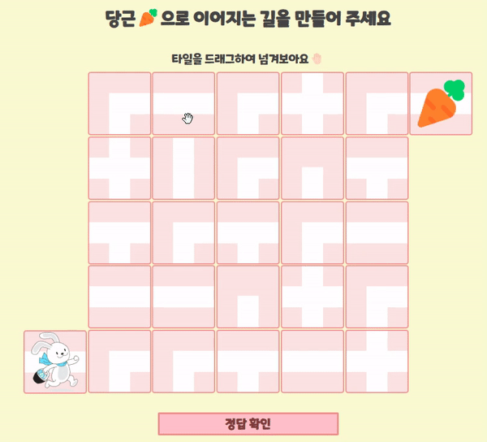
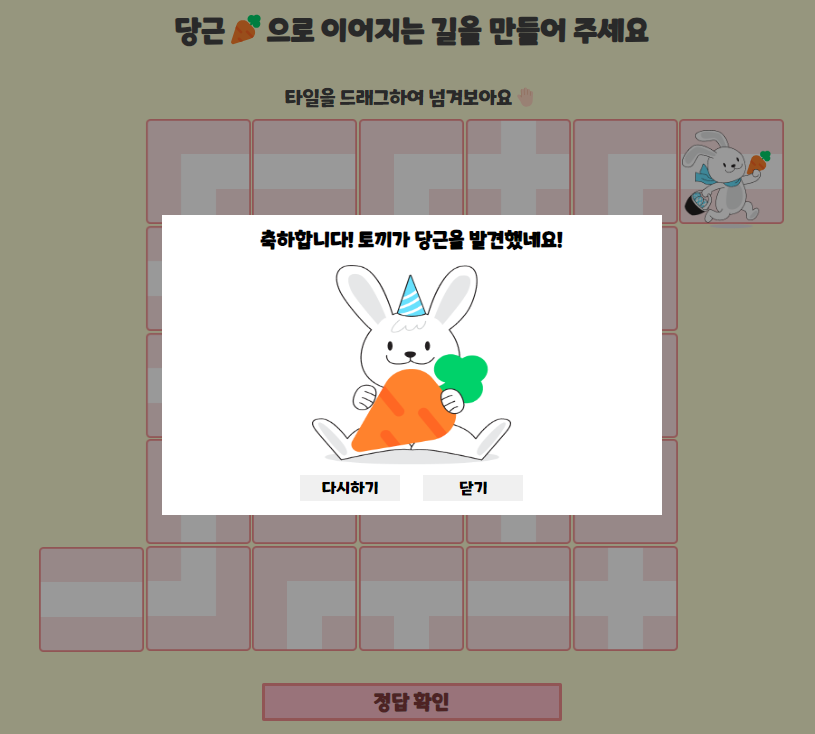
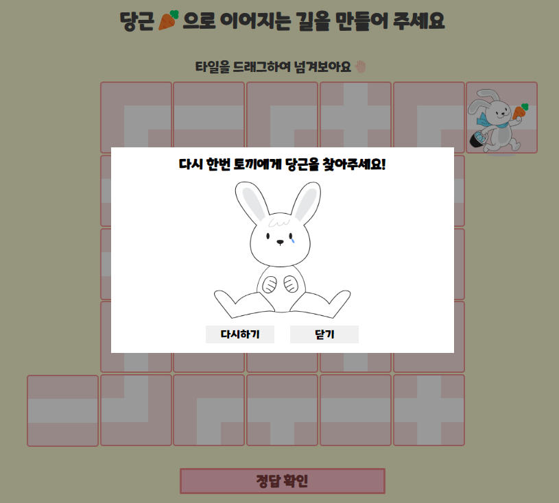
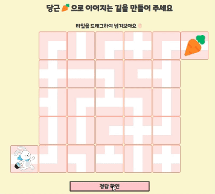

# SWIPER PROJECT - Bunny to Carrot

## 프로젝트 소개

**swiper의 API를 읽고, 재밌는 기능들을 사용하여 재밌고 독특한 carousel 만들기**

- 25개의 swiper의 슬라이더로 퍼즐을 만들어 토끼가 당근에게 갈 수 있는 길을 찾아주는 캐쥬얼 게임을 제작

## 개발 기간

- 2023.12.21 ~ 2023.12.25

## 개발자

- 정서린

## 개발 환경

- HTML, CSS, JavaScript, Swiper.js

## 개발 기능

### 1. 25개의 스와이퍼 슬라이드

swiper.js를 이용한 25개의 슬라이드를 퍼즐로 구현

### 2. 정답 비교

저장된 정답 오브젝트와 현재 슬라이드의 realIndex 의 배열이 포함되어있는지 확인

### 3. 정답 확인 modal

퍼즐의 정답이 맞았을 때

- 토끼 캐릭터가 길에 맞게 당근으로 이동
- 성공 알림 modal창이 활성화

퍼즐의 정답이 틀렸을 때

- 실패 알림 modal창이 활성화

### 4. 애니메이션

퍼즐의 정답이 맞았을 때

- 토끼 캐릭터가 길에 맞게 당근으로 이동

### 5. modal창의 다시하기, 닫기 버튼

다시하기 버튼

- 사이트의 새로고침

닫기 버튼

- 모달 창 비활성화
